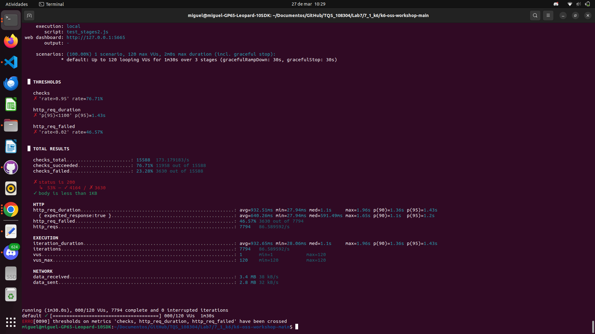
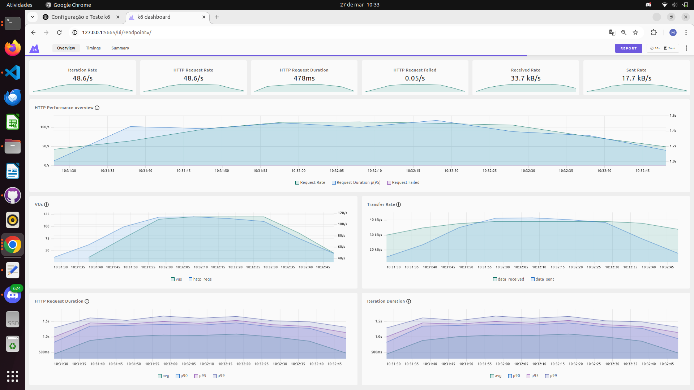
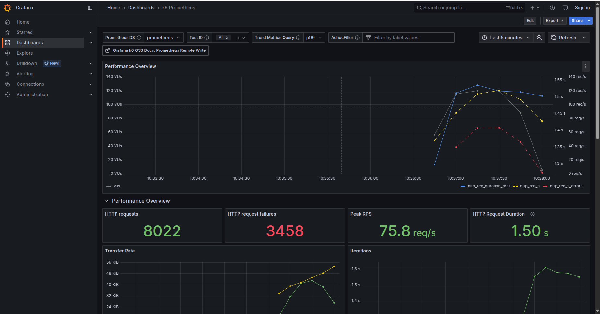
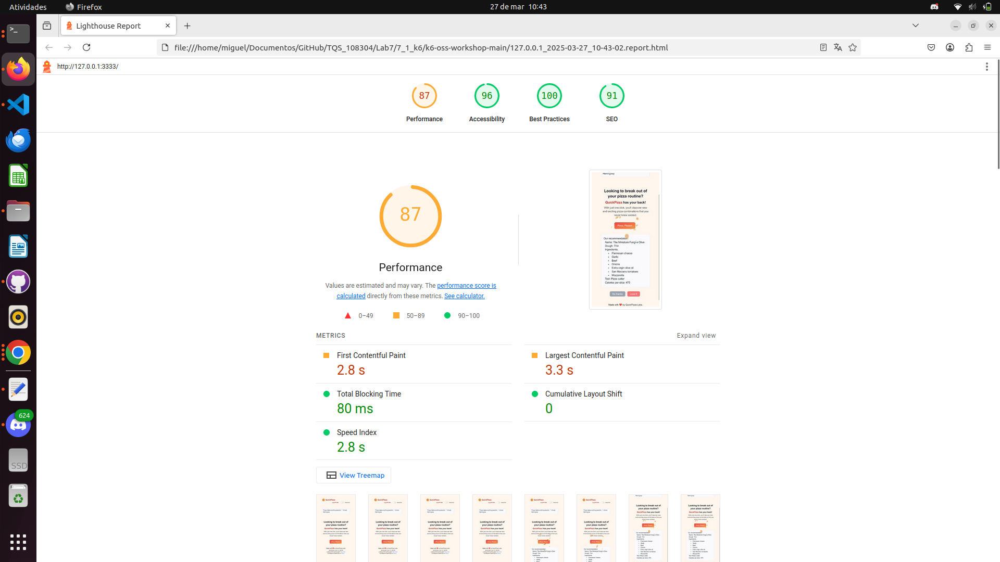
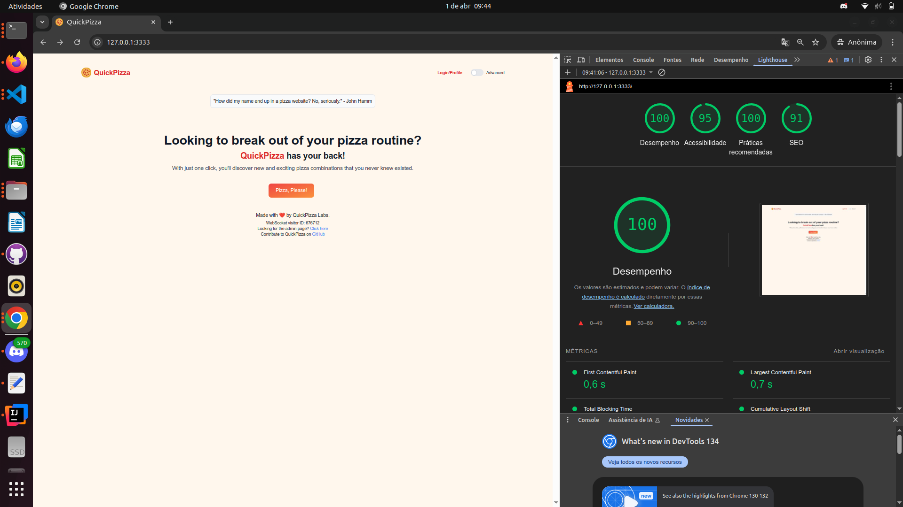

Exercicio 1 e 2 

test.js:

    • How long did the API call take?

        avg=97.98ms
        Demorou 97.98 ms

    • How many requests were made?

        http_reqs=1 
        foi feito 1 request

    • How many requests failed? (i.e., whose HTTP status code was not 200)

        http_req_failed=0.00% 0 out of 1
        Nenhum request falhou

test_stages.js:
    • How long did the API calls take on average, minimum and maximum?

        avg=148.08ms min=3.74ms max=705.6ms

        Demorou de avg 148.08ms, de min 3.74ms e de max 705.6ms .
    
    • How many requests were made?
    
        http_reqs: 2055

        Foram feitos 2055 requests
    
    
    • How many requests failed? (i.e., whose HTTP status code was not 200)

        http_req_failed: 0.00%  0 out of 2055
        Nenhum request falhou

test_stages2.js:

alinea d)

[relatório](k6_report.pdf)

alinea e)

alinea f)

Exercicio 3

alinea c)
    

    What metrics are contributing the most to the frontend perceived performance? What do
    they mean? 

    First Contentful Paint (FCP): 2.8s --> Tempo até o primeiro conteúdo visível ser renderizado.
    

    Largest Contentful Paint (LCP): 3.3s --> Tempo até o maior elemento visível carregar.

    Speed Index: 2.8s --> Mede o quão rápido o conteúdo visível é exibido. 

    Total Blocking Time: 80ms --> Tempo total em que o main thread esteve bloqueado e impediu interações.

   
    How would you make the site more accessible?
    Accessibility:

    " Background and foreground colors do not have a sufficient contrast ratio. "
    Melhorar o contraste entre texto e fundo para ser legivel.

alinea d)

    Usando uma pagina anónima obtivemos melhores performances :
    
    A performance aumentou para 100

    O First Contentful Paint baixou para 0.6s 

    O Largest Contentful Paint baixou 0.7s 

    Isto aconteceu pois usando uma pagina anónima conseguimos eliminar influencias de caches, sessoes etc

alinea f)
    Costumamos usar este testes para garantir que o site é rapido, seguro, e acessível

alinea g)

    No site www.ua.pt os principais problemas identificados foram:
     Desempeho: pontuação de 55
     Acessibilidade de 82
     Praticas recomendadas 74 
     SEO de 85
     Estes problemas afetam a experiência do utilizador e podem prejudicar o posicionamento do site nos motores de busca. Corrigir estes problemas num site que já está em produção há muito tempo pode ser desafiante, principalmente se envolver reestruturações profundas no frontend. No entanto, muitos destes erros poderiam ter sido evitados se houvesse uma prática contínua de auditorias de qualidade durante o desenvolvimento, com integração de ferramentas como o Lighthouse desde o iníciodo desenvolvimento da aplicação.