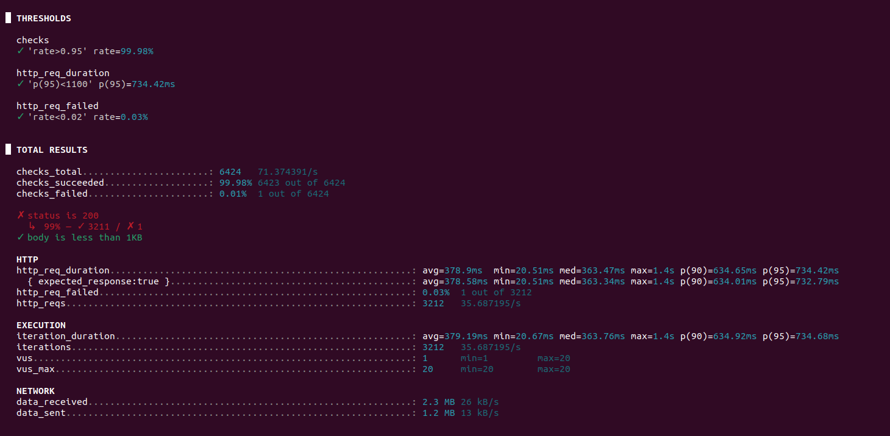

Exercicio 1 e 2 

test.js:

    • How long did the API call take?

        avg=97.98ms
        Demorou 97.98 ms

    • How many requests were made?

        http_reqs=1 
        foi feito 1 request

    • How many requests failed? (i.e., whose HTTP status code was not 200)

        http_req_failed=0.00% 0 out of 1
        Nenhum request falhou

test_stages.js:
    • How long did the API calls take on average, minimum and maximum?

        avg=148.08ms min=3.74ms max=705.6ms

        Demorou de avg 148.08ms, de min 3.74ms e de max 705.6ms .
    
    • How many requests were made?
    
        http_reqs: 2055

        Foram feitos 2055 requests
    
    
    • How many requests failed? (i.e., whose HTTP status code was not 200)

        http_req_failed: 0.00%  0 out of 2055
        Nenhum request falhou

test_stages2.js:

alinea d)

[relatório](k6_report.pdf)

alinea e)

alinea f)

Exercicio 3

What metrics are contributing the most to the frontend perceived performance? What do
they mean? 

    First Contentful Paint (FCP): 2.8s --> Tempo até o primeiro conteúdo visível ser renderizado.
    

    Largest Contentful Paint (LCP): 3.3s --> Tempo até o maior elemento visível carregar.

    Speed Index: 2.8s --> Mede o quão rápido o conteúdo visível é exibido. 

    Total Blocking Time: 80ms --> Tempo total em que o main thread esteve bloqueado e impediu interações.

   
How would you make the site more accessible?
Accessibility:
" Background and foreground colors do not have a sufficient contrast ratio. "
Melhorar o contraste entre texto e fundo para ser legivel.

