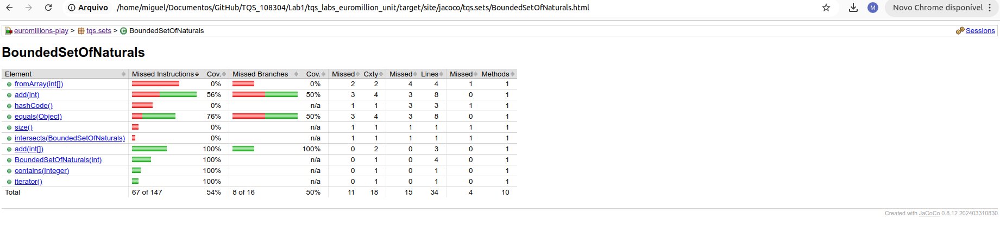
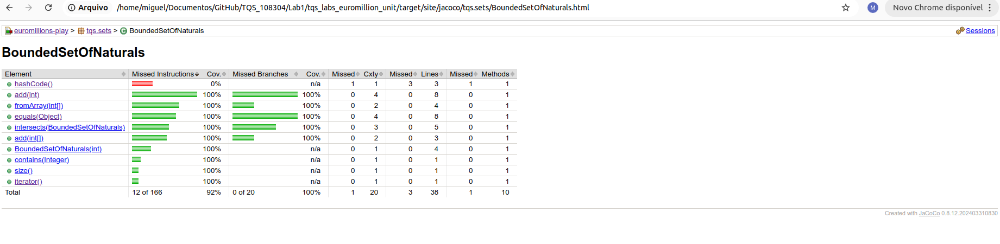

e)
ANTES

DEPOIS

 Usando o JaCoCo mostrou uma grande melhoria na classe BoundedSetOfNaturals. Inicialmente, a percentagem de Missed Instructions era de 54% e a Missed Branches 50%, com vários métodos sem testes adequados. Após novos testes, a percentagem de Missed Instructions subiu para 92%, e a Missed Branches subiu para 100%,. Essas melhorias mostraram uma subida na qualidade do código. 